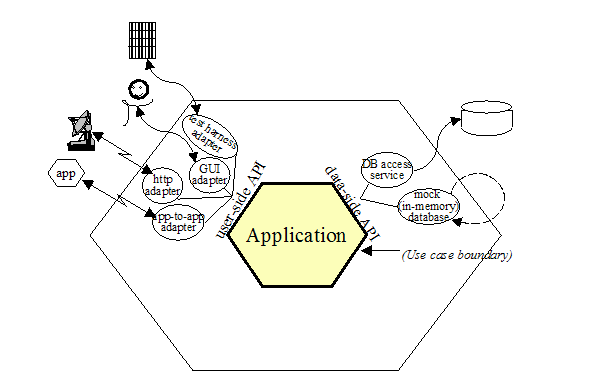

# Portas e Adaptadores ou Arquitetura Hexagonal

Assim como a Arquitetura Limpa, a Arquitetura Hexagonal surge como uma abordagem para o desenvolvimento de aplicações agnósticas em relação às tecnologias. Nessa arquitetura, a lógica de aplicação fica totalmente encapsulada dentro do núcleo, e, para que a informação passe por ele, deve ser submetida a duas estruturas principais situadas nas fronteiras da arquitetura:

- **Portas:** São protocolos e interfaces que definem como a aplicação funciona e quais dados ela necessita, possibilitando a ligação com o mundo externo. As portas podem ser divididas em duas classes: 
  - *Portas principais*, ou adaptadores condutores, que conduzem o usuário a uma ação;
  - *Portas secundárias*, ou adaptadores conduzidos, que levam o usuário a uma ação.  
  Em diagramas, as portas principais aparecem à esquerda e as portas secundárias à direita, respectivamente.

- **Adaptadores:** Estão presentes em cada porta e conectam cada elemento da aplicação com o mundo externo.

Tais fenômenos são ilustrados na Figura abaixo:

  
*Figura: Arquitetura Hexagonal. Fonte:Alistair Cockburn*  

Ao submeter a aplicação proposta a essa arquitetura e, posteriormente, ao SonarQube, observou-se uma eliminação de duplicação de código, com exceção de alguns problemas de manutenibilidade que foram solucionados. No entanto, uma questão não foi possível de ser resolvida devido a restrições da linguagem utilizada.

Algo que chamou a atenção foi a baixa quantidade de linhas de código em comparação com a Arquitetura Limpa, além da facilidade em incorporar novas funcionalidades e testá-las.
